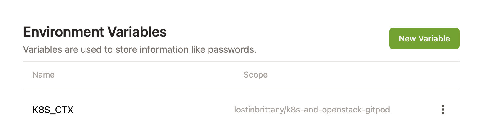

# Gitpod GitPod Workspace for Kubernetes and Go

A working Gitpod setup to work with Kubernetes and Go. The workspace includes:

- For Kubernetes: Kubectl, K9s, Helm, Velero & Kustomize.
- For Go: Go, Operator SDK

To open the workspace, simply click on the *Open in Gitpod* button, or use [this link](https://gitpod.io/#https://github.com/LostInBrittany/k8s-and-golang-gitpod.git).

[](https://gitpod.io/#https://github.com/LostInBrittany/k8s-and-golang-gitpod.git)

## Configuring Kubeconfig

To administrate your Kubernetes cluster from Gitpod, you need to add your Kubeconfig to your Gitpod workspace. There are two ways to do it:

- Copying the content of your `kubeconfig` file into a `~/.kube/config` file in your Gitpod workspace.

    ```bash
    nano ~/.kube/config
    ```

- Adding your kubeconfig as a Gitpod 

Gitpod supports encrypted, user-specific environment variables. They are stored as part of your user settings and can be used to set access tokens, or pass any other kind of user-specific information to your workspaces.

To do it you need to follow this steps:

1. Convert Kubeconfig to base64

    ```bash
    cat kubeconfig | base64 -w 0
    ```

1. Using GitPod variables to define a `K8S_CTX` variable with the content of your `kubeconfig` in base64 as value:

    

    > This project is configured to extract the `kubeconfig` from the value of `K8S_CTX` and inject it in the `~/.kube/config` file:
    > 
    > `.gitpod.yml`:
    > ```yaml
    > tasks:
    >     - name: Set K8s context
    >     command: echo $KUBECONFIG | base64 -d > ~/.kube/config    
    > ```


